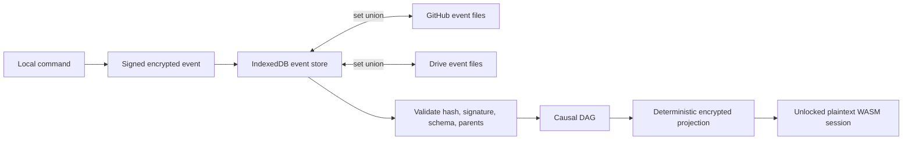

# Replace whole-vault sync with an immutable event log and causal projection

## Imported context

This record was imported from [Nook GitHub issue #112](https://github.com/meta-secret/nook/issues/112)
on 2026-07-25T23:56:27Z. Its historical body and comments are preserved below.

## Original issue body

## Summary

Replace Nook's mutable whole-vault replication (`nook-vault.yaml` + scalar `vault_version`) with an **immutable, content-addressed event/commit log** synchronized by set union, then rebuild the encrypted/materialized vault view using a **causal, domain-specific reducer**.

Recommended stack:

```text
immutable event files
  → set-union synchronization across IndexedDB / GitHub / Drive
  → hash + signature + schema validation
  → causal DAG
  → CRDT-inspired Nook domain projection
  → encrypted local materialized view
  → plaintext WASM session only while unlocked
```

This issue is intentionally more than “add event files.” Immutable storage solves provider write contention, but deterministic and safe convergence also requires:

1. causal metadata;
2. explicit per-domain conflict semantics;
3. signed events;
4. cryptographic key epochs for password/device revocation;
5. a safe migration from existing whole-vault YAML.

**Proposed decision:** use event sourcing plus a small Nook-specific causal reducer. Do **not** use a scalar clock, a vector clock alone, wall-clock last-writer-wins, or a generic CRDT library as the initial solution.

Related:

- #12 — multi-provider storage platform
- #52 — schema versioning and safe migration

---

## Current failure mode

Nook currently models the entire vault as one versioned register:

- [`NookVaultManager::save_current_db`](https://github.com/meta-secret/nook/blob/main/nook-wasm/src/manager/mod.rs#L191-L249) increments one scalar `vault_version`, serializes the complete state, and replaces the provider blob.
- [`compare_vault_sync`](https://github.com/meta-secret/nook/blob/main/nook-core/src/vault_sync.rs#L49-L94) declares the higher scalar version authoritative.
- Equal versions with different bytes become a whole-vault conflict.
- The conflict UI retains either the complete local blob or the complete remote blob; see [unified-vault.md](https://github.com/meta-secret/nook/blob/main/.cortex/design-docs/unified-vault.md#5-sync-reconciliation).
- [`fan_out_sync`](https://github.com/meta-secret/nook/blob/main/nook-core/src/vault_sync_store.rs#L78-L99) reconciles providers sequentially, so provider iteration order can affect the local result.

### Failure A — same counter, independent edits

```text
Base: version 10

Device A: add secret A → version 11
Device B: add secret B → version 11

Result: equal-version whole-vault conflict.
The user must discard either secret A or secret B with the selected blob.
```

### Failure B — a larger counter does not mean newer

```text
Base: version 10

Device A: two offline edits → version 12
Device B: one concurrent security-sensitive edit → version 11

Result: version 12 wins automatically, although it is not causally descended
from version 11. Device B's change is silently discarded.
```

`vault_version` measures “number of saves performed by this branch,” not causal freshness. It is not a distributed revision.

### Failure C — optimistic-lock retry can become a stale overwrite

GitHub and Drive initially use provider revision tokens, but their retry paths refresh the token and resend the original stale whole-vault content:

- [GitHub retry](https://github.com/meta-secret/nook/blob/main/nook-wasm/src/storage/github.rs#L318-L341)
- [Drive retry](https://github.com/meta-secret/nook/blob/main/nook-wasm/src/storage/drive.rs#L234-L263)

That converts an API-level concurrency error into a successful overwrite without merging the competing update.

### Failure D — sequential multi-provider reconciliation is order-sensitive

A newer-looking blob from one provider can replace local state and then be pushed to later providers. The final result can therefore depend on provider order rather than on the union of user operations.

---

## Goals

- Preserve every valid concurrent mutation from every device.
- Never require two devices to update the same remote event path.
- Make synchronization idempotent, associative, and commutative.
- Keep Nook local-first and offline-capable.
- Preserve zero-knowledge behavior: plaintext secrets remain memory-only.
- Preserve current per-record age encryption where practical.
- Make record-level conflicts explicit without blocking unrelated edits.
- Support GitHub, Google Drive, IndexedDB, and future #12 adapters through one event-store interface.
- Make device/password revocation meaningful for **future** data through cryptographic key epochs.
- Provide deterministic rebuilds and an auditable history.

## Non-goals

- Real-time peer-to-peer collaboration.
- Character-level collaborative editing of secure notes.
- Destructive log compaction in the first release.
- Automatically choosing a winner for concurrent secret or access-control mutations.
- Hiding storage-provider deletion/rollback attacks entirely; no decentralized client can prevent a provider from withholding all data without an external trust anchor.

---

## Options considered

| Option | What it solves | What remains | Decision |
|---|---|---|---|
| Keep whole vault + scalar `vault_version` | Simple implementation | Incorrect causality, whole-vault conflicts, overwrite races | Reject |
| Whole vault + vector clock | Detects causal vs concurrent snapshots | Still one mutable path; still needs record merge and tombstones | Reject as complete solution |
| Wall clock / Lamport clock / HLC + LWW | Provides deterministic total order | Deterministically discards valid concurrent intent | Reject for secrets/security |
| Immutable event files only | Removes same-path data contention; preserves operations | Needs ordering, validation, merge semantics, revocation model | Necessary but insufficient |
| Event log + generic CRDT such as Automerge | Causal history and generic merge engine | Storage adapters, encryption, membership, revocation, and domain conflicts remain custom | Defer |
| Event log + causal DAG + domain reducer | Solves transport contention and applies explicit Nook semantics | More up-front domain design | **Recommend** |

A vector clock is useful for detecting concurrency, not resolving it. The event DAG proposed below already records causal ancestry and avoids copying an ever-growing device vector into every event.

A generic CRDT may become appropriate later if secure notes gain collaborative text editing. Current secret records are typed whole values, and replacements already receive a new ID in [`replace_secret`](https://github.com/meta-secret/nook/blob/main/nook-core/src/session.rs#L16-L51), so a small reducer is easier to audit and test.

---

## Target architecture



### Source of truth

The immutable event set becomes the source of truth.

The following are derived caches only:

- encrypted IndexedDB projection;
- optional immutable checkpoints;
- plaintext `Database` / `decrypted_jsonl` WASM session;
- UI arrays.

The current `nook-vault.yaml` becomes a legacy import/export and recovery format, not the live replicated database.

---

## Event identity and remote layout

One **user command/transaction** creates one event file. A transaction may contain several atomic domain operations.

Recommended path:

```text
nook-log/v1/events/<first-two-hash-bytes>/<event-sha256>.event
```

Examples:

```text
nook-log/v1/events/7a/7a3e99...event
nook-log/v1/events/c4/c4f85d...event
```

Rules:

1. Event ID is the SHA-256 digest of canonical event bytes.
2. Event paths are immutable.
3. Creating an already-existing identical event is success.
4. Same path with different bytes is corruption and must be quarantined.
5. Events are uploaded parent-first.
6. No authoritative mutable “latest version” or “current head” file is required.
7. Mutable manifests or checkpoints may exist only as caches and must never be needed to recover correctness.

A random UUID would also avoid collisions, but content addressing additionally provides integrity and natural deduplication.

---

## Proposed event envelope

Illustrative YAML; the signed/hashed representation must use a precisely defined canonical encoding.

```yaml
schema_version: 1
store_id: store_SMypl8K0w9Y
actor_id: key_1f9ed892...
parents:
  - sha256:7a3e99...
created_at: "2026-06-28T02:31:00Z" # display/audit only
key_epoch: sha256:91bc42...
operations:
  - type: secret-replaced
    old_id: secret_old
    new_secret:
      id: secret_new
      secret_type: login
      ciphertext: |
        -----BEGIN AGE ENCRYPTED FILE-----
        ...
signature: ed25519:...
```

### Required envelope properties

- `schema_version`: independently version the event format.
- `store_id`: prevent cross-vault event injection.
- `actor_id`: signing identity, not a timestamp-derived device name.
- `parents`: sorted set of all locally observed causal heads.
- `created_at`: UI/audit information only; never used for correctness.
- `key_epoch`: identifies the cryptographic epoch protecting private payloads.
- `operations`: one or more atomic typed operations.
- `signature`: authorizes and authenticates the event body.
- Event ID/hash: computed after canonicalization; parent IDs form a Merkle DAG.

### Canonical serialization

Do not hash arbitrary YAML text. Define one canonical representation, for example:

- canonical CBOR; or
- a constrained canonical JSON representation with sorted arrays/maps and fixed enum encoding.

The YAML shown above is for readability only unless YAML canonicalization is formally defined.

### Forward compatibility

Unknown `schema_version` must cause:

- event retained locally;
- projection marked incomplete;
- vault opened read-only if a safe prior projection exists;
- clear “upgrade Nook” UI;
- no writes that pretend the unknown event does not exist.

---

## Causal model

Every event references the local set of maximal observed events (`parents`). Therefore:

- A is before B if A is an ancestor of B.
- A and B are concurrent if neither is an ancestor of the other.
- A subsequent event that observes both branches references both heads and causally joins them.

This removes the need for a shared counter. An optional per-actor counter may be retained for diagnostics and fork detection but should not be the event identity or global order.

Events with unknown parents are stored as pending and not applied until their dependencies arrive. Sync should continue trying all providers for missing parents.

---

## Domain operations and projection semantics

The reducer must produce the same result for every permutation of the same valid event set. A topological sort may simplify implementation, but concurrent semantics must not depend on arbitrary processing order.

| Domain operation | Recommended semantics |
|---|---|
| Create secret with generated ID | Add to a grow-only set; exact duplicate event is idempotent |
| Delete secret | Causal tombstone removes versions visible to the deleting event |
| Replace secret | Atomic `delete old + create new` in one event |
| Concurrent replacements of one old secret | Preserve both new records; create a conflict group requiring user resolution |
| Independent concurrent secret additions | Preserve both automatically |
| Join request | Add by request/device identity; duplicate request is idempotent |
| Join approval | Atomic request resolution + auth grant + member addition |
| Join denial | Resolve/hide the pending request; it is not revocation of an already-issued grant |
| Member rename | Cosmetic causal register; deterministic display tie-break is acceptable while alternatives remain inspectable |
| Device revoke | Security operation; starts a new key epoch |
| Add backup password | New unique credential entry wrapping current epoch keys |
| Rotate/remove password | Security operation; starts a new key epoch |
| Clear/reset vault | Explicit destructive operation, never inferred from missing records |

### Secret replacement conflicts

Current UI replacement already generates a new secret ID. If two devices concurrently replace the same old record:

```text
old secret X
  ├─ device A → new secret A
  └─ device B → new secret B
```

Both new records should remain accessible. The UI may group them as “concurrent updates to X” and let the user resolve by emitting another event that causally observes both branches.

### Conflict policy

- Do not block unrelated secret additions because one aggregate is conflicted.
- Do not use LWW for secret content.
- Do not use LWW for password entries, grants, revocations, or epoch selection.
- Security conflicts should fail closed or require explicit resolution.
- A hash tie-break may be used only for harmless presentation fields.

---

## Event authenticity and device identity

Current device identity is age/X25519 encryption material. X25519 is not a signing identity.

Add a signing keypair:

1. Persist an Ed25519 private key beside the X25519 private identity in IndexedDB.
2. Join requests publish both encryption and signing public keys.
3. Encrypted member records retain both public keys.
4. Every enrolled-device event is signed.
5. The projector accepts a signed event only if the actor was authorized in the event's causal past.
6. Genesis/import establishes the initial trust root.
7. Password-based self-enrollment includes proof derived from `members_key`, then registers the new signing key.

Signatures improve integrity against a party that has provider write access but not vault keys. They do not stop a provider from deleting or withholding all events; multiple replicas and remembered local heads mitigate but cannot mathematically eliminate that threat.

---

## Security release gate: cryptographic key epochs

This is mandatory before append-only auth/password events can ship.

Nook currently wraps the same long-lived `secrets_key` and `members_key` in device auth rows and password entries. The current password specification explicitly says password rotation does not rotate those underlying keys:

- [password key hierarchy](https://github.com/meta-secret/nook/blob/main/.cortex/product-specs/password-envelope.md#2-key-hierarchy-extended)
- [password rotation](https://github.com/meta-secret/nook/blob/main/.cortex/product-specs/password-envelope.md#42-rotate-password)
- [`attach_password_envelope`](https://github.com/meta-secret/nook/blob/main/nook-core/src/password_envelope.rs#L205-L235)

In an append-only log, an old envelope/grant remains forever. If it unwraps the same current keys, then:

- removed passwords still unlock current data;
- rotated passwords do not invalidate old enrollment material;
- revoked devices can recover keys from their historical grant;
- old credentials can decrypt future secret events.

This concern partially exists today because GitHub Contents API writes create commits and historical `nook-vault.yaml` versions can retain old envelopes. Drive also maintains revisions, with different retention/download semantics.

### Required epoch behavior

1. Each epoch has fresh `secrets_key` and `members_key`.
2. Every private event identifies its epoch.
3. Adding an additional password may wrap the current epoch keys.
4. Removing/rotating a password creates a fresh epoch.
5. Revoking a device creates a fresh epoch.
6. New epoch keys are wrapped only for remaining authorized devices/passwords.
7. Emit a fresh encrypted checkpoint of all **currently live** secrets and roster data under the new epoch, so a newly enrolled current device need not possess old epoch keys.
8. All subsequent events use the new epoch.
9. Historical members may retain historical data they were already authorized to see, but cannot decrypt future epochs.

Epoch identity should be the rotation event ID/hash, not another global integer.

### Concurrent rotations

Concurrent epoch rotations form security branches and must not be resolved by timestamp or hash. The vault should enter a security-conflict state and require an authorized device capable of resolving the relevant branches to emit a new merged epoch.

This scenario needs explicit recovery tests, including the pathological case where two devices concurrently revoke one another.

---

## IndexedDB design

Bump `nook_db` to a new version and add stores such as:

| Store | Key | Purpose |
|---|---|---|
| `events` | `[store_id, event_id]` | Immutable canonical event bytes and validation state |
| `projections` | `store_id` | Encrypted materialized view + projection version + included heads |
| `provider_receipts` | `[store_id, provider_id, event_id]` or compact equivalent | Known upload/download state |
| `outbox` | `[provider_id, event_id]` | Retryable remote appends |
| existing `vault` | existing keys | Device encryption/signing identities and legacy migration data |

The persisted projection must contain ciphertext, never plaintext secret values. Plaintext remains in the WASM session as required by the current architecture.

### Local mutation ordering

```text
1. Validate command against current projection
2. Construct, encrypt, sign, and hash event
3. Commit event to IndexedDB transaction
4. Apply/rebuild local projection
5. Update unlocked session/UI
6. Queue fan-out uploads
```

Local persistence happens before remote I/O. A failed provider upload leaves a durable outbox entry rather than rolling back the user's local mutation.

Multiple tabs may append distinct events safely. BroadcastChannel/Web Locks can improve responsiveness and signing-head coordination, but correctness must come from immutable IDs and IndexedDB transactions rather than a process-local mutex.

---

## Provider interface

Replace blob-oriented sync with an event-store interface conceptually equivalent to:

```text
list_event_ids(provider, store_id, cursor?)
fetch_event(provider, store_id, event_id)
put_event_if_absent(provider, store_id, event_id, bytes)
```

Optional later operations:

```text
list_checkpoints(...)
put_checkpoint_if_absent(...)
fetch_pack(...)
```

There is deliberately no `update_event` or `delete_event` in v1.

---

## GitHub implementation

GitHub still has branch-level concurrency even when event paths differ, because each Contents API PUT creates a commit. The important difference is that a rejected append is safely retryable:

1. PUT a new unique event path without a file SHA.
2. If another device advanced the branch and GitHub returns `409`, retry creating the same path against the new branch head.
3. If the event path now exists with identical content, treat it as success.
4. Never fetch a newer SHA and use it to replace an existing different file.

### Listing constraints

GitHub's Contents API caps a directory listing at 1,000 entries. Use:

- hash-sharded directories; and/or
- Git Trees API for recursive discovery;
- non-recursive subtree traversal when a recursive tree is truncated.

Official constraints:

- [Contents API directory limit](https://docs.github.com/en/rest/repos/contents#get-repository-content)
- [Git Trees recursive limits](https://docs.github.com/en/rest/git/trees#get-a-tree)

One commit per event is acceptable for the first correctness-focused implementation. Future immutable pack files can reduce commit/API overhead without changing event semantics.

---

## Google Drive implementation

Store each event as a separate immutable app-data file. Identify it through the file name and/or `appProperties` containing `store_id` and `event_id`.

Requirements:

- query `spaces=appDataFolder`;
- fetch every `nextPageToken`;
- tolerate duplicate names caused by concurrent create races;
- deduplicate by content-derived event ID;
- quarantine same ID with invalid/different content;
- never update a prior event file.

References:

- [Store application-specific data](https://developers.google.com/workspace/drive/api/guides/appdata)
- [Drive files.list pagination](https://developers.google.com/workspace/drive/api/reference/rest/v3/files/list)

---

## Synchronization algorithm

For each provider:

```text
1. List all remote event IDs (or use a validated incremental cursor).
2. Download IDs absent from IndexedDB.
3. Validate store ID, canonical hash, signature, schema, epoch, and parent references.
4. Insert valid events; quarantine invalid events.
5. Upload local IDs absent remotely, parents first.
6. Repeat later for eventual-listing delays or partial pages.
```

After all currently available remote events are inserted:

```text
7. Recompute causal heads.
8. Rebuild or incrementally update the encrypted projection.
9. Refresh the unlocked session if keys are available.
10. Propagate newly learned events from provider A to providers B/C.
```

The result depends only on the event set, not provider order.

### Missing and corrupt events

- Unknown parent: retain event as pending; do not apply it.
- Invalid hash/signature: quarantine and show provider diagnostics.
- Missing event on one provider but present locally/elsewhere: repair by uploading it.
- Deliberately removed event: another replica will restore it; user-visible deletion is a domain tombstone event.
- Missing terminal head with no descendants cannot always be detected after total local loss; document this rollback limitation in the threat model.

---

## Checkpoints and compaction

Performance is not a release concern, so v1 should replay all events.

Optional immutable checkpoints may later contain:

- projection schema version;
- included event heads/set digest;
- current encrypted materialized records;
- current key epoch;
- signer and signature.

A checkpoint is accepted only after validating its covered history. It is a cache, not a new mutable authority.

Do not delete historical events in the first release. Safe garbage collection requires a separate design covering replica acknowledgements, offline devices, epoch history, backups, and rollback.

---

## Immediate safety patch before the migration

The full redesign is substantial. Stop the worst current loss modes first.

- [ ] GitHub: on `409/422`, refetch and return a conflict; do not resend stale content with a refreshed SHA.
- [ ] Drive: on `412`, refetch and return a conflict; do not resend stale content with a refreshed revision.
- [ ] Persist the last common content hash per provider.
- [ ] Only classify one blob as a causal successor when it descends from the remembered common content.
- [ ] Treat divergent blobs as conflicts even when their scalar versions differ.
- [ ] Fetch every provider before choosing/applying a local state; do not let provider iteration order select a winner.
- [ ] Consider a temporary three-way merge for disjoint record IDs, with manual handling of password/auth/member changes.

This interim work should be independently releasable and tested.

---

## Implementation plan

### Phase 0 — ADR, threat model, and docs

- [ ] Add `.cortex/design-docs/vault-event-log.md` as the canonical decision record.
- [ ] Define event schema, canonical encoding, causal rules, and conflict taxonomy.
- [ ] Define key-epoch and revocation guarantees.
- [ ] Reconcile the older mutually-exclusive password-mode text with the current hybrid `auth:` + `password_entries` implementation.
- [ ] Update #12 so new providers implement event-store primitives instead of one mutable blob.
- [ ] Update #52: an active mutable manifest must not become a new single-writer correctness dependency.

### Phase 1 — `nook-core` event model

Suggested modules:

- [ ] `vault_event.rs` — versioned envelope and typed operations.
- [ ] `event_canonical.rs` — canonical bytes, hash, signature payload.
- [ ] `vault_event_graph.rs` — parent validation, ancestry, heads, pending events.
- [ ] `vault_projection.rs` — deterministic domain reducer and conflict records.
- [ ] `vault_epoch.rs` — epoch creation, grants, rotation, encrypted checkpoints.
- [ ] `vault_import.rs` — legacy YAML to root/import event.

Keep:

- `Database` as the plaintext session model;
- `vault_format.rs` for legacy import/export and optional checkpoints;
- existing typed `SecretValue` and per-record age crypto where possible.

Deprecate after migration:

- scalar `vault_sync.rs` comparison;
- `MemoryVaultStore` whole-blob reconciliation;
- `vault_version` as a correctness primitive.

### Phase 2 — authenticity and epoch crypto

- [ ] Add device signing key generation/storage.
- [ ] Extend join/member structures with signing public keys.
- [ ] Validate actor authorization in causal history.
- [ ] Implement password self-enrollment proof.
- [ ] Implement epoch rotation and current-state re-encryption.
- [ ] Define concurrent-rotation conflict/recovery behavior.

### Phase 3 — local event store

- [ ] IndexedDB schema upgrade.
- [ ] Atomic local append.
- [ ] Event validation/quarantine state.
- [ ] Durable outbox per provider.
- [ ] Encrypted projection cache keyed by projection schema and heads.
- [ ] Rebuild session from projection after unlock.
- [ ] Cross-tab notification and race tests.

### Phase 4 — provider adapters

- [ ] GitHub list/fetch/append-if-absent.
- [ ] GitHub sharded tree traversal and branch-conflict retry.
- [ ] Drive paginated list/fetch/create.
- [ ] Provider-neutral event sync orchestration in `nook-wasm`.
- [ ] Multi-provider set-union fan-out.
- [ ] Provider diagnostics for missing/corrupt/pending events.

### Phase 5 — WASM manager and UI

- [ ] Replace `save_current_db` whole-blob writes with local event appends.
- [ ] Convert secret CRUD to event transactions.
- [ ] Convert join/approve/deny/rename/revoke flows.
- [ ] Convert password add/rotate/remove flows.
- [ ] Replace whole-vault conflict dialog with aggregate conflict UI.
- [ ] Do not block unrelated edits for a secret-level conflict.
- [ ] Show local outbox and per-provider sync health.
- [ ] Replace `lastSyncedVersion` metadata with event-set/head metadata.

### Phase 6 — migration

- [ ] Back up exact legacy `nook-vault.yaml` bytes.
- [ ] Create deterministic `ImportedSnapshotV1` root event containing/preserving existing encrypted state.
- [ ] Persist root locally before remote upload.
- [ ] Upload root/event history to all providers.
- [ ] Freeze legacy YAML as a recovery artifact; avoid indefinite dual writes.
- [ ] Detect and block old clients/open tabs from writing legacy format after log activation.
- [ ] If a second device has a divergent legacy blob, import it as a recovery branch and surface record-level conflicts rather than overwriting it.
- [ ] Preserve the original vault until migration verification and rollback policy from #52 are satisfied.

### Phase 7 — rollout and cleanup

- [ ] Feature flag event-log vault creation.
- [ ] Dogfood with local + GitHub before migrating existing users.
- [ ] Add Drive once event-store adapter tests pass.
- [ ] Disable creation of new scalar-version vaults.
- [ ] Remove legacy write paths only after rollback window.
- [ ] Keep legacy reader/export support.

---

## Migration details and relationship to #52

#52 proposes schema-specific files plus a mutable `nook-vault.meta.yaml` active pointer. That is appropriate as a migration convenience, but a mutable pointer must not become the source of synchronization truth; it would recreate the same concurrent-access problem in a smaller file.

Recommended migration flow:

1. Read and decrypt the current local authoritative YAML.
2. Preserve an immutable byte-for-byte backup.
3. Convert current encrypted records/auth/password/member state into one deterministic imported root/checkpoint event.
4. Record the source blob hash for idempotency and diagnostics.
5. Append subsequent events locally.
6. Upload the immutable event set to all providers.
7. Mark local provider configuration as log mode.
8. Treat remote manifests as discoverability/optimization only.
9. A device discovering a valid log root must not independently overwrite it with its stale YAML.
10. If its legacy content hash differs, offer/import a recovery branch.

Mixed old/new clients are the hardest rollout condition. Do not silently dual-write forever. The design must specify how an old open tab is prevented from continuing to mutate `nook-vault.yaml` after log activation.

---

## Testing strategy

### Algebraic/core invariants

- [ ] `project(events)` is identical for every permutation of `events`.
- [ ] Event union is associative: `(A ∪ B) ∪ C = A ∪ (B ∪ C)`.
- [ ] Event union is commutative: `A ∪ B = B ∪ A`.
- [ ] Event union is idempotent: `A ∪ A = A`.
- [ ] Exact duplicate event delivery changes nothing.
- [ ] Unknown-parent events remain pending.
- [ ] Unknown-schema events block unsafe writes.
- [ ] Forged/wrong-store/corrupt events are rejected or quarantined.

### Domain scenarios

- [ ] Two devices concurrently add different secrets; both survive.
- [ ] One device deletes a secret after observing its creation; it remains deleted after every replay order.
- [ ] Concurrent replacements retain both candidates and a conflict marker.
- [ ] Conflict resolution event causally supersedes both candidates.
- [ ] Concurrent password additions with distinct IDs both survive.
- [ ] Password removal/rotation starts a new epoch.
- [ ] Revocation starts a new epoch.
- [ ] Old password cannot decrypt new-epoch checkpoint/events.
- [ ] Revoked device cannot decrypt new-epoch checkpoint/events.
- [ ] New member can decrypt all current live secrets from the current epoch without historical keys.
- [ ] Concurrent epoch rotations surface a security conflict.

### Provider/integration scenarios

- [ ] GitHub concurrent distinct event appends converge after branch `409` retry.
- [ ] Drive duplicate event-file names deduplicate by hash.
- [ ] Partial pagination never marks a provider fully synchronized.
- [ ] Provider A events propagate through local storage to provider B.
- [ ] Provider order does not affect projection.
- [ ] Corrupt event on one provider does not overwrite a valid local/other-provider copy.
- [ ] Offline device reconnects and contributes events without overwriting newer events.

### Browser E2E

- [ ] Two Playwright contexts start from the same vault, go offline, add separate secrets, reconnect, and both see both secrets.
- [ ] Concurrent replacements show conflict UI without blocking an unrelated add.
- [ ] Join approval and password self-enrollment produce signed valid events.
- [ ] Device revocation rotates epoch and locks the revoked browser.
- [ ] IndexedDB v1 → event-store migration preserves all secrets and unlock paths.
- [ ] Legacy backup remains byte-identical through migration.

Property-based tests in `nook-core` are strongly recommended for replay permutations and random interleavings.

---

## Success criteria

- [ ] No normal concurrent device mutation requires overwriting an event written by another device.
- [ ] Concurrent independent secret changes never require whole-vault “keep local/keep remote.”
- [ ] The same valid event set always produces the same projection.
- [ ] Synchronization result is independent of provider ordering.
- [ ] Provider optimistic-lock retries cannot turn stale whole-state content into a successful overwrite.
- [ ] Plaintext secret values remain memory-only.
- [ ] Event deletion/tampering is detected where cryptographically possible.
- [ ] Password rotation/removal and device revocation prevent access to future epochs.
- [ ] Existing vaults migrate with an immutable recovery backup and no silent conflict loss.
- [ ] GitHub and Drive implement the same provider-neutral event operations.
- [ ] Domain logic and convergence invariants are covered in `nook-core`; browser workflows are covered by E2E.

---

## Open design decisions

1. Canonical CBOR versus canonical JSON for signed/hashed event bytes.
2. Exact signing crate/key format and migration of existing device identities.
3. Fail-closed behavior and recovery UX for concurrent security events.
4. Whether the imported root is one large event or an immutable base checkpoint plus normal events.
5. How to detect/block mixed legacy clients during cutover.
6. Whether current-state epoch checkpoints are stored as one large file or immutable shards.
7. Initial GitHub listing strategy: sharded Contents traversal versus Git Trees API.
8. When immutable pack files become necessary for provider API efficiency.

---

## References

- [Martin Fowler — Event Sourcing](https://martinfowler.com/eaaDev/EventSourcing.html)
- [Lamport — Time, Clocks, and the Ordering of Events](https://lamport.azurewebsites.net/pubs/time-clocks.pdf)
- [Amazon Dynamo — vector clocks and semantic reconciliation](https://assets.amazon.science/ac/1d/eb50c4064c538c8ac440ce6a1d91/dynamo-amazons-highly-available-key-value-store.pdf)
- [Shapiro et al. — Conflict-Free Replicated Data Types](https://pages.lip6.fr/Marek.Zawirski/papers/CRDTs-SSS2011.pdf)
- [Automerge Rust documentation](https://automerge.org/automerge/automerge/)
- [GitHub Contents API](https://docs.github.com/en/rest/repos/contents)
- [GitHub Git Trees API](https://docs.github.com/en/rest/git/trees)
- [Google Drive appDataFolder](https://developers.google.com/workspace/drive/api/guides/appdata)
- [Google Drive file revisions](https://developers.google.com/workspace/drive/api/guides/manage-revisions)


## Historical comments

No comments.
