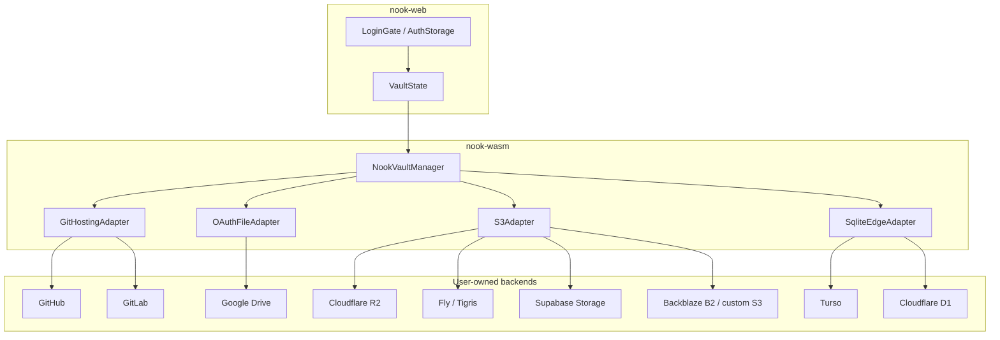

# Epic: Multi-provider storage platform — aggregated vision

## Imported context

This record was imported from [Nook GitHub issue #12](https://github.com/meta-secret/nook/issues/12)
on 2026-07-25T23:56:27Z. Its historical body and comments are preserved below.

## Original issue body

# Epic: Multi-provider storage platform — aggregated vision

**This is the parent issue** for Nook’s storage provider expansion. It defines the overall architecture, provider landscape, and implementation order. Child issues track concrete deliverables.

---

## The idea (one paragraph)

Nook is a **zero-knowledge** password manager: secrets are encrypted in the browser; remote storage only ever sees an encrypted blob. Today users pick **Local** (IndexedDB) or **GitHub** (PAT + `nook-vault.yaml` in a repo). This epic expands that to a **pluggable storage platform** with **three generic adapters** — not one integration per vendor. Each vendor (Cloudflare R2, GitLab, Turso, Google Drive, …) is a **preset**: a friendly login label plus a small set of provider-specific parameters on top of shared read/write/sync logic. Users bring **their own** cloud account (or sign in with OAuth where available); Nook never hosts user vaults.

---

## What stays the same (non‑negotiable)

| Principle | Meaning |
|-----------|---------|
| **Zero-knowledge** | Vault plaintext never leaves the browser unencrypted. Remote stores hold encrypted YAML only. |
| **Device identity** | Device keys live in `nook_db` (IndexedDB), separate from provider credentials. |
| **One logical vault** | Same vault format (`nook-vault.yaml` semantics) across all backends — multi-device enroll/join unchanged. |
| **Credentials ≠ encryption** | PAT, S3 keys, DB tokens, OAuth tokens in `nook_auth` are **storage convenience**. Compromise = remote access, not plaintext secrets. |
| **Login-first UX** | Provider pick → one-time setup → unlock → vault. Settings for reconnect / add provider. |

---

## Target architecture: three adapters, many presets

Do **not** build N× separate WASM storage modules. Build **three generic backends**; vendors are configuration presets.



### Adapter 1 — Git-hosting file API

**Vault shape:** single file `nook-vault.yaml` in a git repository.  
**Concurrency:** blob SHA / revision id on PUT.  
**Auth:** PAT (GitHub, GitLab) or OAuth (future).

| Preset | Status | Issue |
|--------|--------|-------|
| GitHub | ✅ Shipped | — |
| GitLab | Planned | [#8](https://github.com/meta-secret/nook/issues/8) |

---

### Adapter 2 — S3-compatible object storage

**Vault shape:** single object (default key `nook-vault.yaml`).  
**Concurrency:** ETag.  
**Auth:** Access key + secret + endpoint + bucket (+ region, `forcePathStyle` where needed).

| Preset | Free tier (approx.) | Issue |
|--------|---------------------|-------|
| Cloudflare R2 | 10 GB, zero egress | [#7](https://github.com/meta-secret/nook/issues/7) *(defines generic S3 adapter)* |
| Fly.io / Tigris | 5 GB, zero egress | [#9](https://github.com/meta-secret/nook/issues/9) |
| Supabase Storage | 1 GB | [#10](https://github.com/meta-secret/nook/issues/10) |
| Backblaze B2 | 10 GB | Preset only after #7 |
| Custom S3 | varies | #7 (`preset: custom`) |

**Unified config (from #7):**

```typescript
type StorageProviderType = 'local' | 'github' | 's3' | 'sqlite-edge' | 'oauth-file'

interface S3StorageConfig {
  preset?: 'cloudflare-r2' | 'fly-tigris' | 'supabase-storage' | 'backblaze-b2' | 'custom'
  endpoint: string
  region: string
  bucket: string
  accessKeyId: string
  secretAccessKey: string
  objectKey?: string        // default: nook-vault.yaml
  forcePathStyle?: boolean  // true for Supabase
}
```

Adding R2 vs Tigris vs Supabase = **UI preset + docs**, not new Rust module.

---

### Adapter 3 — Edge SQLite (libSQL / D1)

**Vault shape:** one encrypted row in a SQL table (same content bytes as `nook-vault.yaml`).  
**Concurrency:** integer `version` column (optimistic lock).  
**Auth:** Turso database URL + token; Cloudflare account + database ID + API token.

| Preset | Free tier (approx.) | Issue |
|--------|---------------------|-------|
| Turso | 5 GB, 500 DBs, libSQL HTTP | [#11](https://github.com/meta-secret/nook/issues/11) *(defines generic edge-SQLite adapter)* |
| Cloudflare D1 | 5 GB total, 500 MB/DB | [#11](https://github.com/meta-secret/nook/issues/11) |

**Unified config (from #11):**

```typescript
interface SqliteEdgeConfig {
  preset: 'turso' | 'cloudflare-d1'
  databaseUrl?: string      // Turso
  authToken?: string        // Turso
  accountId?: string        // D1
  databaseId?: string       // D1
  apiToken?: string         // D1 (D1:Edit)
}
```

Turso ships first (best browser-direct HTTP); D1 reuses schema, different transport.

---

### Adapter 4 — OAuth file storage (planned)

**Vault shape:** single file in user’s cloud drive (same encrypted blob).  
**Concurrency:** Drive `revisionId` / similar.  
**Auth:** OAuth 2 — user clicks “Sign in with Google”; tokens stored in IndexedDB.

| Preset | Why it matters | Status |
|--------|----------------|--------|
| **Google Drive** | Almost everyone has Google; best mainstream UX (no keys to copy) | **Planned — sub-issue TBD** |

**User experience:** one click OAuth.  
**Implementation:** Google Cloud project, OAuth client, scopes (`drive.appdata` or `drive.file`), token refresh, Drive API file adapter — same *family* as GitHub/GitLab, different auth path.

This is the recommended **mainstream onboarding** provider alongside power-user presets (R2, Turso, etc.).

---

## Provider landscape — why so many?

Different users already pay for / trust different platforms. Nook meets them where they are:

| User profile | Best preset | Auth UX |
|------------|-------------|---------|
| General public | **Google Drive** | OAuth — “Sign in with Google” |
| Developers | GitHub, GitLab | PAT |
| Cloudflare users (`nokey.sh`, R2, D1) | R2, D1 | S3 keys / API token |
| Fly.io users | Tigris | S3 keys from `fly storage create` |
| Supabase stack | Supabase Storage | S3 keys from project settings |
| SQLite / edge DB fans | Turso, D1 | DB URL + token |
| Self-hosters | Custom S3, GitLab self-hosted, MinIO | Manual endpoint |

**Free tier summary (storage-focused):**

| Provider | Free storage | Egress | S3? | OAuth? |
|----------|-------------|--------|-----|--------|
| Google Drive | ~15 GB (shared) | included | — | ✅ |
| Cloudflare R2 | 10 GB | $0 | ✅ | — |
| Fly / Tigris | 5 GB | $0 | ✅ | — |
| Turso | 5 GB | — | — | — |
| Cloudflare D1 | 5 GB (account) | — | — | — |
| Backblaze B2 | 10 GB | 1 GB/day direct | ✅ | — |
| Supabase Storage | 1 GB | 5+5 GB/mo | ✅ | — |
| GitHub / GitLab | repo fair use | — | — | PAT |

---

## Data model evolution

Today ([auth-providers.ts](nook-web/src/lib/auth-providers.ts)):

```typescript
type StorageProviderType = 'local' | 'github'
```

Target:

```typescript
type StorageProviderType =
  | 'local'
  | 'github'           // git-hosting preset: github
  | 'gitlab'           // git-hosting preset: gitlab (or collapse to 'git-hosting')
  | 's3'               // all S3-compatible presets
  | 'sqlite-edge'      // Turso + D1
  | 'oauth-file'       // Google Drive (+ future Dropbox, OneDrive)

interface StorageProvider {
  id: string
  type: StorageProviderType
  label: string
  createdAt: string
  githubPat?: string
  githubRepo?: string
  gitlabPat?: string
  gitlabRepo?: string
  gitlabBaseUrl?: string
  s3?: S3StorageConfig
  sqliteEdge?: SqliteEdgeConfig
  oauthFile?: OAuthFileConfig   // google: refreshToken, fileId, …
}
```

Longer term: collapse `github` / `gitlab` → `git-hosting` with preset enum (same pattern as S3).

IndexedDB store `nook_auth` unchanged in structure — `providers[]` + `activeProviderId`.

---

## WASM / Rust boundary

Today: `connect(storage_mode, github_pat, github_repo)` — GitHub-specific.

Target options (open decision):

1. **Serialized provider config** — web passes JSON config; WASM dispatches to adapter by `type`
2. **Typed expansion** — extend args per type (doesn't scale)

Recommended: **provider config blob** + adapter registry in `nook-wasm`. Validation stays in `nook-core` ([validation.rs](nook-core/src/validation.rs)).

Package boundaries unchanged: crypto + vault format in `nook-core`; remote I/O in `nook-wasm`; UI/state in `nook-web`.

---

## UI vision

### Login gate — provider picker grouped by audience

```
┌─────────────────────────────────────────┐
│  Sign in to nook                        │
│                                         │
│  Popular                                │
│    [ Google Drive ]  ← OAuth, one click │
│    [ GitHub ]        ← existing         │
│                                         │
│  Object storage (S3)                    │
│    [ Cloudflare R2 ] [ Fly.io ]         │
│    [ Supabase ]    [ Custom S3… ]       │
│                                         │
│  Edge database                          │
│    [ Turso ] [ Cloudflare D1 ]          │
│                                         │
│  Git hosting                            │
│    [ GitLab ]                           │
│                                         │
│  Local                                  │
│    [ This device only ]                 │
└─────────────────────────────────────────┘
```

Branded presets pre-fill forms; **Custom S3** / **Custom git** for power users.

### Settings — multi-provider ready

- Add / remove / reconnect providers ([auth-providers.md](.cortex/design-docs/auth-providers.md) §5)
- **Future:** replicate vault to multiple backends simultaneously (not in initial child issues)

---

## Implementation phases

### Phase 0 — Foundation (current)

- [x] Local + GitHub
- [x] Custom domain `nokey.sh` ([PR #5](https://github.com/meta-secret/nook/pull/5))
- [x] Multi-device sync on GitHub

### Phase 1 — Generic S3 adapter + first presets *(blocks 9, 10)*

- [ ] [#7 — Generic S3 adapter + Cloudflare R2 preset](https://github.com/meta-secret/nook/issues/7)
- [ ] [#9 — Fly.io / Tigris preset](https://github.com/meta-secret/nook/issues/9)
- [ ] [#10 — Supabase Storage preset](https://github.com/meta-secret/nook/issues/10)

**Exit criteria:** One WASM S3 module; three presets; e2e with optional CI secrets.

### Phase 2 — Git-hosting expansion

- [ ] [#8 — GitLab (+ refactor shared git-file adapter)](https://github.com/meta-secret/nook/issues/8)

**Exit criteria:** GitHub + GitLab share repo-file trait; no duplicated Contents API logic.

### Phase 3 — Edge SQLite

- [ ] [#11 — Generic edge-SQLite adapter + Turso + D1 presets](https://github.com/meta-secret/nook/issues/11)

**Exit criteria:** Vault row schema; Turso HTTP; D1 REST; multi-device sync.

### Phase 4 — Mainstream OAuth

- [ ] **Google Drive** (sub-issue to be created)
  - OAuth 2 (`drive.appdata` or `drive.file`)
  - Drive file adapter (revision-based concurrency)
  - Google Cloud Console app + consent / verification plan

**Exit criteria:** User signs in with Google; vault syncs without copying keys.

### Phase 5 — Multi-provider replication (future epic)

From [auth-providers.md](.cortex/design-docs/auth-providers.md) §5:

- Write vault to multiple backends (e.g. GitHub + R2 + Drive)
- Version vector / content-hash reconciliation
- Not scoped in child issues #7–#11

---

## Child issues tracker

| # | Title | Adapter family | Depends on |
|---|-------|----------------|------------|
| [#7](https://github.com/meta-secret/nook/issues/7) | Cloudflare R2 + **generic S3** | S3 | — |
| [#8](https://github.com/meta-secret/nook/issues/8) | GitLab + **generic git-file** | Git-hosting | — |
| [#9](https://github.com/meta-secret/nook/issues/9) | Fly.io / Tigris preset | S3 | #7 |
| [#10](https://github.com/meta-secret/nook/issues/10) | Supabase Storage preset | S3 | #7 |
| [#11](https://github.com/meta-secret/nook/issues/11) | Turso + D1 + **generic edge-SQLite** | Edge SQL | — |
| *TBD* | Google Drive (OAuth) | OAuth file | Phase 2 git-file patterns helpful |

---

## Testing strategy

- **Unit tests** (`nook-core`): credential validation per preset; no network
- **Adapter tests**: S3 mock / MinIO; SQL schema + version conflicts
- **E2e** (Playwright): one spec per preset, gated on env secrets (`NOOK_GITHUB_PAT`, `NOOK_S3_*`, `NOOK_TURSO_*`, …) — skipped in CI without secrets
- **Multi-device e2e**: genesis + joiner devices per backend (pattern: [multi-device-github.spec.ts](nook-web/e2e/multi-device-github.spec.ts))

---

## Documentation deliverables

- [ ] Rewrite [auth-providers.md](.cortex/design-docs/auth-providers.md) for three adapter families + presets
- [ ] Extend [password-manager.md](.cortex/product-specs/password-manager.md) §2 (storage adapters)
- [ ] Per-preset user setup guides (CORS for S3, PAT scopes for git, OAuth for Drive, …)

---

## Success criteria (epic complete)

1. **Three generic adapters** live: S3, git-hosting (GitHub+GitLab), edge-SQLite (Turso+D1)
2. **Six+ presets** shippable: GitHub, GitLab, R2, Tigris, Supabase, Turso, D1 (+ Custom S3)
3. **Google Drive OAuth** shipped or tracked as final Phase 4 child issue
4. **Zero-knowledge invariant** preserved — no provider sees plaintext secrets
5. **Multi-device sync** works on every preset
6. **Adding a new S3 or git preset** requires config + UI + docs only — no new adapter code

---

## Open program-level decisions

1. Collapse provider types to 4 enums (`local`, `git-hosting`, `s3`, `sqlite-edge`, `oauth-file`) vs per-vendor types?
2. WASM API: JSON provider config vs expanded function signatures?
3. Google Drive scope: `drive.appdata` vs `drive.file`?
4. Phase ordering: Google Drive before or after S3/git power-user presets?
5. Issue #7 + #11 in parallel (independent adapters) or sequential?

---

*This epic (#12) is the single source of truth for storage provider vision. Child issues contain preset-specific acceptance criteria; when a child closes, update the phase checklist above.*

## Historical comments

### cypherkitty — 2026-06-21T20:45:01Z

Google Drive OAuth provider tracked as #13 (Phase 4).

### cypherkitty — 2026-07-04T03:52:11Z

PR #181 updates the #112 implementation so future providers should target the event-store contract rather than a single mutable `nook-vault.yaml` blob:

- provider API shape is `list_event_ids`, `fetch_event`, and `put_event_if_absent`;
- event writes are immutable/content-addressed and synchronized by set union;
- provider fan-out repairs missing local events per provider instead of choosing a whole-vault winner by provider iteration order;
- legacy blob writes remain compatibility/recovery paths only and now fail closed on optimistic-lock conflicts.

For #12, new storage providers should implement append-only event records plus provider receipts/outbox handling, not scalar `vault_version` replacement semantics.

