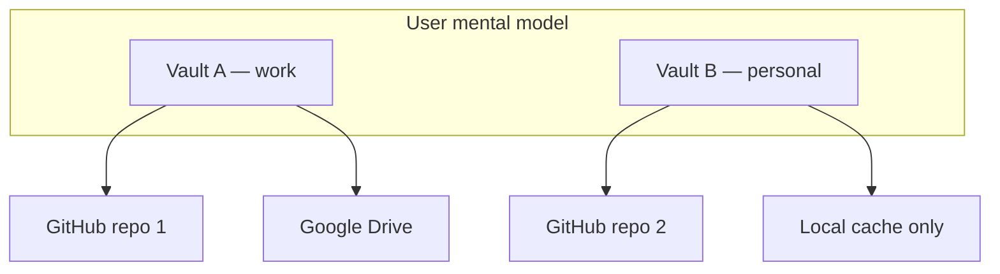

# Multi-vault support: create many vaults with per-vault sync providers

## Imported context

This record was imported from [Nook GitHub issue #120](https://github.com/meta-secret/nook/issues/120)
on 2026-07-25T23:56:27Z. Its historical body and comments are preserved below.

## Original issue body

## Problem

Nook currently supports **one active vault per browser profile**, with **many sync providers** replicating that single vault. Users cannot create or switch between multiple independent vaults (e.g. work vs personal) on the same device without overwriting or manually migrating the local cache.

This is a product gap in both **UI** and **functionality**.

## Current behavior (today)

| Area | Behavior |
|------|----------|
| **Local cache** | Single `encrypted_db` key in `nook_db` IndexedDB — one vault blob per browser profile |
| **Sync providers** | Many providers in `nook_auth`, all fan-out replicas of the **one** active `store_id` |
| **Login gate** | Detects one local vault → unlock, or connect a sync provider to pull/create |
| **Settings** | Sync providers manage replica targets for the **current** vault only |
| **Lock** | Clears decrypted session; returns to login gate for the same single vault |

If a user connects a sync provider whose remote `store_id` differs from the local vault, reconciliation **rejects** the merge (`store_id_mismatch` conflict) — by design, but there is no UX to open that vault as a separate database.

**Design docs explicitly call this out as follow-on work:**

- [vault-session-and-lock.md §3](https://github.com/meta-secret/nook/blob/main/.cortex/design-docs/vault-session-and-lock.md#3-current-vs-target-multiple-vaults-on-one-browser) — *Today vs Target* table
- [unified-vault.md §2](https://github.com/meta-secret/nook/blob/main/.cortex/design-docs/unified-vault.md#2-target-model) — *"Today: one active vault per browser profile. Target: vault picker after lock"*
- [auth-providers.md §5](https://github.com/meta-secret/nook/blob/main/.cortex/design-docs/auth-providers.md#5-sync-replication-implemented) — multi-vault picker listed as **Planned**

## Target behavior

Users should be able to:

1. **Create multiple vaults** on the same browser (each with its own `store_id`, secrets, devices, version counter).
2. **Assign sync providers per vault** — Vault A → GitHub repo 1 + Google Drive; Vault B → different GitHub repo (not a shared global provider list).
3. **Switch vaults** after Lock (or via a vault picker) without wiping IndexedDB or confusing replicas.
4. **Import/open a vault from a provider** as a distinct vault when `store_id` differs from the currently active one.

## Proposed UX (from design docs)

| Surface | Target |
|---------|--------|
| **Login gate / after Lock** | Vault chooser: open existing / create new / import from sync provider |
| **Header or settings** | Switch vault (locks current session, shows chooser) |
| **Settings → Sync providers** | Scoped to **active vault only**; provider list filtered by `storeId` |
| **Create vault** | Explicit "Create new vault" — does not overwrite existing vaults in IDB |

## Data model changes (high level)

The `store_id` + per-provider `storeId` fields already exist; the gap is **storage layout and session scoping**:

| Store | Today | Target |
|-------|-------|--------|
| `nook_db` | One `encrypted_db` blob | Multiple vault blobs keyed by `store_id` (or vault registry + blobs) |
| `nook_auth` | Flat `providers[]` list | Providers grouped/filtered per vault (`storeId`); possibly `activeVaultId` |
| `VaultState` | Assumes single active vault | Active vault context; switch without data loss |

Device identity (`device_identity_secret`) may need per-vault scoping or a documented sharing model — see [secret-store-identity.md](https://github.com/meta-secret/nook/blob/main/.cortex/design-docs/secret-store-identity.md).

## Acceptance criteria

- [ ] User can create a second vault without deleting or overwriting the first
- [ ] User can list vaults on this device (local cache + metadata: label, `store_id`, last unlock)
- [ ] User can switch active vault (Lock → picker → unlock chosen vault)
- [ ] Sync providers added in Settings apply only to the active vault's `store_id`
- [ ] Connecting a provider with a different `store_id` offers **import as new vault** (not only conflict error)
- [ ] E2E: two vaults on one browser profile — create, add distinct sync providers, switch, verify isolation
- [ ] Design docs updated when implementation lands

## Out of scope (for this issue)

- Multi-provider replication across backends for one vault — **done** (unified vault epic #70)
- Adding new sync provider types (R2, GitLab, …) — tracked in #12
- Event-log sync (#112)

## Related issues

- #70 (closed) — Unified vault epic: local-first, many sync providers **per vault**
- #12 — Multi-provider storage platform (new provider presets)
- #63–#69 (closed) — Unified vault phases (assumed single active vault)

## Implementation notes

- Start from [vault-session-and-lock.md §3](https://github.com/meta-secret/nook/blob/main/.cortex/design-docs/vault-session-and-lock.md#3-current-vs-target-multiple-vaults-on-one-browser) and [local-vault.ts](https://github.com/meta-secret/nook/blob/main/nook-web/src/lib/local-vault.ts) (single `ENCRYPTED_DB_KEY`)
- `VaultState.createFreshVault()` and login gate flows need vault-context awareness
- Migration path for existing users with one `encrypted_db` + flat provider list

## Historical comments

No comments.
