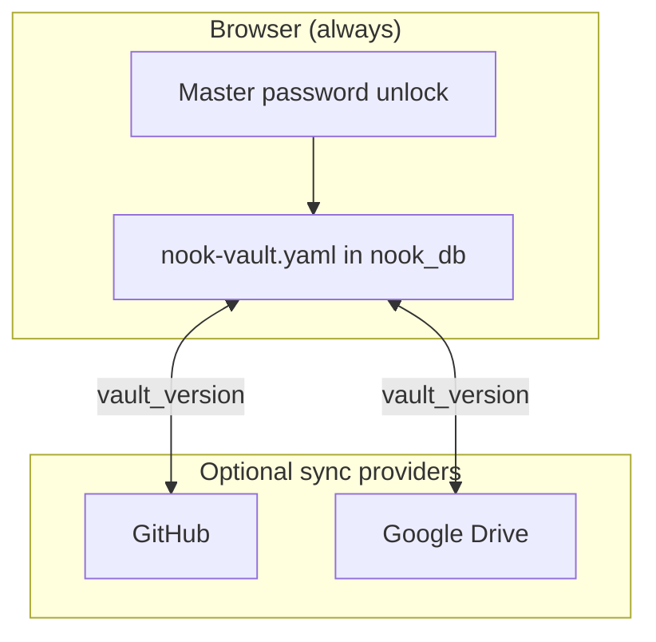

# Epic: Unified vault — local-first architecture with version sync

## Imported context

This record was imported from [Nook GitHub issue #70](https://github.com/meta-secret/nook/issues/70)
on 2026-07-25T23:56:27Z. Its historical body and comments are preserved below.

## Original issue body

# Epic: Unified vault — local-first architecture with version sync

**This is the parent issue** for migrating Nook from **provider-as-vault** to a **local-first unified vault** with optional sync providers and version-based reconciliation.

**Architecture:** [`.cortex/design-docs/unified-vault.md`](.cortex/design-docs/unified-vault.md)  
**UI rollout:** [`.cortex/exec-plans/unified-vault-ui-rollout.md`](.cortex/exec-plans/unified-vault-ui-rollout.md)

---

## The idea (one paragraph)

Today each saved storage provider can point at a **separate vault file** — switching providers switches databases. The unified vault model keeps **one authoritative copy** in browser IndexedDB (`nook_db`), unlocked with a **master password**, and treats GitHub / Google Drive / future backends as **sync replicas** of that same `store_id`. Saves bump a monotonic `vault_version`; `compare_vault_sync` auto-reconciles when versions differ (higher wins) and surfaces a **conflict dialog** when versions match but content diverged.

---

## What stays the same

| Principle | Meaning |
|-----------|---------|
| **Zero-knowledge** | Plaintext never leaves the browser unencrypted |
| **Device identity** | X25519 keys in `nook_db`, separate from sync credentials |
| **Vault format** | Same `nook-vault.yaml` semantics (`store_id`, `secrets:`, `auth:`, …) |
| **Multi-device** | Join/approve/enroll flows unchanged in spirit |

---

## Target architecture

---

## Implementation phases

### Phase 0 — Foundation ✅

- [x] `vault_version` in vault YAML
- [x] `compare_vault_sync` in `nook-core`
- [x] WASM `compareVaultSync` export
- [x] Architecture docs + UI rollout plan
- **PR:** [#61](https://github.com/meta-secret/nook/pull/61)

### Phase 1 — Login gate

- [ ] [#62 — Password-first local unlock](https://github.com/meta-secret/nook/issues/62)

### Phase 2 — Sync providers (Settings)

- [ ] [#63 — Settings sync providers](https://github.com/meta-secret/nook/issues/63)

### Phase 3 — Conflict resolution

- [ ] [#64 — Conflict dialog](https://github.com/meta-secret/nook/issues/64)

### Phase 4 — Vault fan-out sync

- [ ] [#65 — Secret vault fan-out](https://github.com/meta-secret/nook/issues/65)

### Phase 5 — Onboard

- [ ] [#66 — Local-first enrollment QR](https://github.com/meta-secret/nook/issues/66)

### Phase 6 — Help

- [ ] [#67 — Help documentation](https://github.com/meta-secret/nook/issues/67)

### Phase 7 — Multi-device + sync

- [ ] [#68 — Join flows with sync propagation](https://github.com/meta-secret/nook/issues/68)

### Phase 8 — Migration & cleanup

- [ ] [#69 — Legacy migration and deprecation](https://github.com/meta-secret/nook/issues/69)

---

## Child issues tracker

| # | Title | Status |
|---|-------|--------|
| [#62](https://github.com/meta-secret/nook/issues/62) | Phase 1: Login gate | Open |
| [#63](https://github.com/meta-secret/nook/issues/63) | Phase 2: Sync providers | Open |
| [#64](https://github.com/meta-secret/nook/issues/64) | Phase 3: Conflict dialog | Open |
| [#65](https://github.com/meta-secret/nook/issues/65) | Phase 4: Vault fan-out | Open |
| [#66](https://github.com/meta-secret/nook/issues/66) | Phase 5: Onboard | Open |
| [#67](https://github.com/meta-secret/nook/issues/67) | Phase 6: Help | Open |
| [#68](https://github.com/meta-secret/nook/issues/68) | Phase 7: Multi-device | Open |
| [#69](https://github.com/meta-secret/nook/issues/69) | Phase 8: Migration | Open |

---

## Success criteria (epic complete)

1. Local vault is always canonical; sync providers are optional replicas
2. Master password is the primary unlock path on login
3. `vault_version` reconciliation works automatically; conflicts require user choice
4. Legacy provider-as-vault users migrated without data loss
5. All phases have e2e coverage

---

## Related

- PR [#61](https://github.com/meta-secret/nook/pull/61) — foundation
- Epic [#12](https://github.com/meta-secret/nook/issues/12) — multi-provider storage platform (orthogonal; sync providers reuse those adapters)

## Historical comments

### cypherkitty — 2026-06-28T00:28:48Z

Phase 1 implementation in progress: PR #71 → #61

### cypherkitty — 2026-06-28T07:19:27Z

Completed in #79 (squash-merged to `main` as bb54d6b). Unified vault rollout: local-first IndexedDB vault, sync providers with version reconciliation, conflict dialog, fan-out sync, onboard/enrollment, help copy, join propagation, and legacy migration.
