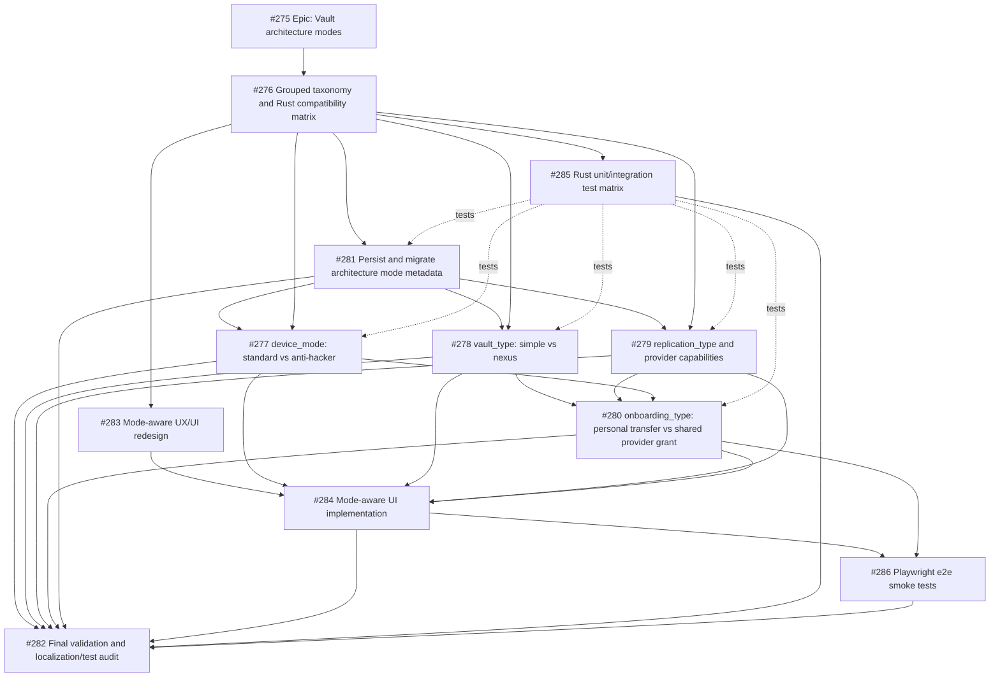

# Implementation dependency graph for vault architecture modes

## Imported context

This record was imported from [Nook GitHub issue #287](https://github.com/meta-secret/nook/issues/287)
on 2026-07-25T23:56:27Z. Its historical body and comments are preserved below.

## Original issue body

## Parent

Part of #275.

## Purpose

This issue is the ordering map for implementing the full vault architecture modes feature. Every issue in the feature pack should link here so agents can see prerequisites, parallel workstreams, and final validation dependencies before starting.

Solid arrows are hard implementation prerequisites. Dotted arrows are test/validation guardrails that should be developed with the target work and must be complete before the milestone closes.

## Dependency Graph

## Suggested Implementation Waves

| Wave | Issues | Why this order matters |
| --- | --- | --- |
| 0. Architecture contract | #276 | Establish grouped Rust-owned vocabulary first so later agents do not flatten the model again. |
| 1. Foundations in parallel | #281, #285, #283 | Persisted metadata, Rust test scaffolding, and UX map can proceed once #276 defines the contract. |
| 2. Domain slices in parallel | #277, #278, #279 | Device protection, vault DEK/share model, and provider capability are separate domains but all consume #276/#281. |
| 3. Cross-domain onboarding | #280 | Onboarding depends on vault type and provider capability, and must respect device mode. |
| 4. UI implementation | #284 | UI should consume Rust/WASM mode and capability decisions, after #283 and the core flows exist. |
| 5. Browser smoke and final audit | #286, #282 | E2E proves the user paths; final validation audits Rust tests, e2e, localization, logs, and issue DoD. |

## Subagent Workstreams

- **Architecture/domain agent:** #276, then coordinate #281 contracts.
- **Device/vault crypto agent:** #277 and #278, with #285 tests landing alongside.
- **Provider/onboarding agent:** #279 then #280, especially provider capability and shared identity/grant flow.
- **UX/UI agent:** #283 then #284, consuming Rust/WASM decisions rather than reimplementing policy.
- **Validation agent:** #285, #286, then #282 as the milestone closeout audit.

## Maintenance Rule

When a dependency changes, update this issue first, then update the affected child issue body or comments. This issue is the canonical implementation ordering map for the milestone.

## Historical comments

### cypherkitty — 2026-07-09T18:27:02Z

## Closeout
Dependency graph completed via PR #288. All linked implementation issues #276–#286 closed with evidence.

Residual (not milestone blockers):
- #261 SLIP-0039 primitives (interim GF(256) documented)
- Live Google Drive OAuth exercise outside stubs: https://github.com/meta-secret/nook/issues/279

Evidence: PR https://github.com/meta-secret/nook/pull/288 (HEAD `55da584a`, base `nook-v2`). Local validation: `task check` and `task ci:pr` green (113 e2e passed; nexus ceremony + architecture modes + sync-vault covered).

### cypherkitty — 2026-07-09T18:27:03Z

Closing as completed via PR #288 (`55da584a` → `nook-v2`). Local `task check` + `task ci:pr` green.

### cypherkitty — 2026-07-09T19:43:19Z

Reopened as the dependency tracker while the audited #279/#280/#282/#283/#284/#286 gaps are completed and revalidated.

### cypherkitty — 2026-07-10T00:50:22Z

The dependency graph has been executed end-to-end: all implementation issues #276-#286 are complete in PR #293, merged into nook-v2 as 7f5da1a23ae5a24f1fa2bf95bf479aeb533fe22c. Exact-head CI, preview deployment, 92.28% Rust coverage, and 115/115 production Playwright tests passed.

### cypherkitty — 2026-07-10T06:15:57Z

The original dependency graph assumed replication selection was part of vault creation. The corrected lifecycle in #275/#278 and PR #294 supersedes that assumption: Simple creation is local; Nexus has its own provider-free all-N genesis and T-of-N unlock ceremony; sync providers are attached only after genesis as encrypted storage. This issue remains closed as the historical implementation plan.
